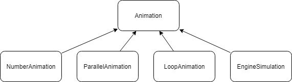

# composite-design-pattern

composite-design-pattern repo contains an example implementation of the Composite Design Pattern. The implementation also uses the Bridge Design Pattern, which makes the source code easy to unit test. 

The current use case is implementing an asynchronous simulation library which generates events for an external car simulator service.

Architecture schema
-------------------

Animation base class
--------------------

The Animation base class starts a thread and generates events, which are propagated anynchronously on a callback.

The API of the Animation base class is presented below.

~~~cpp
void notifyValueChanged(std::string eventName, std::string newValue);
typedef std::function< decltype(notifyValueChanged) > NotifyValueChangedCallback;

void finished();
typedef std::function< decltype(finished) > FinishedCallback;

class Animation {
public:
	Animation(std::string name);
	virtual ~Animation();

	virtual int start();
	virtual void stop();
	virtual void waitToFinish();

	virtual void setNotifyValueChangedCallback(NotifyValueChangedCallback notify);
	virtual void setFinishedCallback(FinishedCallback notify);
};
~~~

NumberAnimation class
---------------------

The NumberAnimation class generates integer values (numbers), covering an input interval, during a specified time frame. 
For example, the code below would notify integer values in the 0-30 interval (0, 1, 2, ..., 30), over a period of 3 seconds (3000 ms).

~~~cpp
NumberAnimation numberAnimation(0 /*from*/, 30 /*to*/, 3000 /*duration in milliseconds*/);
~~~

ParallelAnimation class
-----------------------

The ParallelAnimation class runs up to four Animation instances in parallel.

LoopAnimation class
-------------------

The LoopAnimation class runs an Animation instance in a loop.

EngineSimulation class
----------------------

The EngineSimulation class generates "vehicle.speed", "engine.speed" and "gear.shift" events, while accelerating from first gear to sixth, and then decelerating to zero.

The use of Composite Design Pattern in implementing the Animation classes allows easy implementation of various simulations, as presented below.

Usage example 1
---------------

The construction below runs a main animation in a loop, while the main animation runs other animations in parallel. 

~~~cpp
std::shared_ptr<LoopAnimation> animation = std::make_shared<LoopAnimation>(
	std::make_shared<ParallelAnimation>(
		std::make_shared<NumberAnimation>("vehicle.speed", 0, 30, 3000), 
		std::make_shared<NumberAnimation>("engine.speed", 1, 6.1, 3000, 1)); 
	),
	0 /*infinite loops*/);
/*
animation.setNotifyValueChangedCallback(
	std::bind(&ThisClass::onValueChanged, this, std::placeholders::_1, std::placeholders::_2));

animation.setFinishedCallback(
	std::bind(&ThisClass::onAnimationFinished, this));
*/
animation->start();
animation->waitToFinish();
~~~

Usage example 2
---------------

The construction below runs the EngineSimulation in parallel with a turn indicator simulation.

~~~cpp
std::shared_ptr<ParallelAnimation> animation = std::make_shared<ParallelAnimation>(
	std::make_shared<EngineSimulation>(), 
	std::make_shared<NumberAnimation>("turn-indicator-onoff", 1, 0, 10000), /* send 1 = turn-indicator-on, sleep 10 seconds, send 0 = turn-indicator-off */);

animation.setNotifyValueChangedCallback(
	 {
		std::cout << eventName.c_str() << " changed " << newValue.c_str() << std::endl;
	});

animation.setFinishedCallback(
	 {
		std::cout << "The animation finished" << std::endl;
	});

animation->start();
animation->waitToFinish();
~~~
